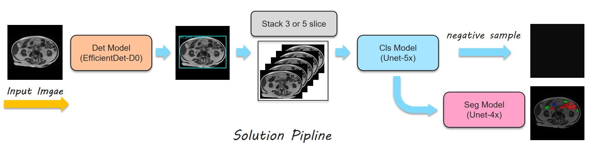
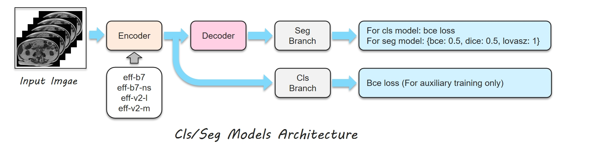

# UW-Madison GI Tract Image Segmentation - 3rd Place Solution

<div align="center">

[](https://www.kaggle.com/competitions/uw-madison-gi-tract-image-segmentation/leaderboard)
[](https://www.python.org/)
[](https://pytorch.org/)
[](LICENSE)

**🥉 3rd Place Solution | Private LB: 0.88255 | Public LB: 0.89162**

[📄 Code](https://github.com/Hesene/UW-Madison-GI-Tract-Image-Segmentation-3rd-Place-Solution) • [🚀 Quick Start](#quick-start) • [📊 Results](#results) • [🔧 Training](#training)

</div>

<p align="center">
  
</p>

---

## 📋 Table of Contents

- [Overview](#overview)
- [Key Features](#key-features)
- [Architecture](#architecture)
- [Installation](#installation)
- [Quick Start](#quick-start)
- [Training](#training)
- [Results](#results)
- [Important Findings](#important-findings)
- [Citation](#citation)
- [Acknowledgements](#acknowledgements)

---

## 🎯 Overview

This repository contains the **3rd place solution** for the [UW-Madison GI Tract Image Segmentation](https://www.kaggle.com/competitions/uw-madison-gi-tract-image-segmentation) competition on Kaggle. The challenge focuses on automatically segmenting the **stomach**, **small bowel**, and **large bowel** in MRI scans to assist medical professionals in cancer treatment planning.

### Competition Results

| Leaderboard | Score | Rank |
|-------------|-------|------|
| **Private** | **0.88255** | **🥉 3rd** |
| **Public** | **0.89162** | **Top 0.5%** |

---

## ✨ Key Features

- 🏆 **Award-winning pipeline** - 3rd place solution with detailed implementation
- 🔬 **Multi-stage architecture** - Detection → Classification → Segmentation
- 🧠 **Advanced ensemble** - 9 models (5 classification + 4 segmentation)
- 📊 **2.5D approach** - 5-slice stacking for better spatial understanding
- ⚡ **State-of-the-art techniques** - SWA, EMA, CutMix, MixUp
- 🎨 **Clean code structure** - Easy to understand and reproduce

---

## 🏗️ Architecture

<p align="center">
  
</p>

Our solution adopts a **three-stage pipeline**:

### 1️⃣ Detection Model
- **Model**: EfficientDet-D0
- **Purpose**: Crop body regions, remove invalid edge images
- **Input Size**: 256×256
- **Training**: 10 epochs

### 2️⃣ Classification Models (×5)
| Model | Backbone | Input Size | Slices |
|-------|----------|------------|--------|
| UNet | EfficientNet-B7 | 320×320 | 5 |
| UNet | EfficientNet-B7-NS | 320×320 | 5 |
| UNet | EfficientNet-V2-L | 320×320 | 3 |
| UNet | EfficientNet-V2-L | 320×320 | 5 |
| UNet | EfficientNet-V2-M | 352×352 | 5 |

### 3️⃣ Segmentation Models (×4)
| Model | Backbone | Input Size | Slices | Pretrained |
|-------|----------|------------|--------|------------|
| UNet | EfficientNet-V2-L | 384×384 | 5 | Classification |
| UNet | EfficientNet-V2-L(v1) | 416×416 | 5 | Classification (320) |
| UNet | EfficientNet-V2-L(v2) | 416×416 | 5 | Segmentation (384) |
| UNet | EfficientNet-V2-M | 416×416 | 5 | Classification (352) |

---

## 📦 Installation

### Prerequisites
- Python 3.8+
- CUDA 11.3+ (for GPU training)
- 24GB+ GPU memory (A5000 recommended)

### Setup

```bash
# Clone the repository
git clone https://github.com/yourusername/uw-madison-gi-tract-segmentation.git
cd uw-madison-gi-tract-segmentation

# Create virtual environment
python -m venv venv
source venv/bin/activate  # On Windows: venv\Scripts\activate

# Install dependencies
cd seg_models
pip install -r requirements.txt
```

### Data Preparation

1. Download the competition dataset from [Kaggle](https://www.kaggle.com/competitions/uw-madison-gi-tract-image-segmentation/data)
2. Organize the data as follows:

```
seg_models/data/
├── train/              # Training images
├── masks/              # Generated masks
├── train_stack_5_slice/ # 5-slice stacked images
└── train_fold_updata.csv # 5-fold split metadata
```

---

## 🚀 Quick Start

### Full Pipeline

```bash
# 1. Data preprocessing
cd seg_models
python k_folds_split.py
python preprocess.py
python preprocess_mask.py

# 2. Run complete training pipeline
sh run_all.sh

# 3. Inference
sh run_predict.sh
```

### Detection Model

```bash
cd det_models

# Preprocess images
python normal_uw_images.py ../data/train/ ./datasets/images/

# Train detection model
sh train.sh

# Inference (generates train_add_effdet0.json)
sh infer.sh
```

---

## 🔧 Training

### Classification Models

```bash
cd seg_models

# Pretrain with small size (256/288)
sh run_cls_pretrained.sh

# Train with large size
sh run_cls_models.sh

# Stochastic Weight Averaging (SWA)
sh run_cls_swa.sh
```

**Training Configuration:**
- **Loss**: Binary Cross Entropy (BCE)
- **Optimizer**: AdamW
- **Learning Rate**: 5e-4 (cyclic with warmup)
- **Epochs**: 35
- **Data Augmentation**: CutMix + MixUp (p=0.33)
- **EMA**: Enabled during training

### Segmentation Models

```bash
cd seg_models

# Train segmentation models
sh run_seg_models.sh

# SWA ensemble
sh run_seg_swa.sh

# Optional: Fine-tuning
sh run_seg_models_finetune.sh
sh run_seg_swa_finetune.sh
```

**Training Configuration:**
- **Loss**: Combined (BCE: 0.5 + Dice: 0.5 + Lovasz: 1)
- **Optimizer**: AdamW
- **Learning Rate**: 3e-4 (cyclic with warmup)
- **Epochs**: 35
- **Pretrained**: Classification models

### Training Time

| Stage | Models | GPU | Time |
|-------|--------|-----|------|
| Classification | 25 models (5 folds × 5) | A5000 | 4-5 days |
| Segmentation | 20 models (5 folds × 4) | A5000 | 3-4 days |

---

## 📊 Results

### Leaderboard Performance

| Model Configuration | Private Score | Public Score | Rank |
|---------------------|---------------|--------------|------|
| Full Ensemble (9 models) | **0.88255** | **0.89162** | 🥉 3rd |
| Without 3-slice model | 0.88318 | 0.89023 | - |

### Ablation Study

| Configuration | Private | Public | Rank |
|---------------|---------|--------|------|
| Detection + Single Fold Cls | 0.87211 | 0.88224 | 71 |
| + Single Fold Seg | 0.87723 | 0.88451 | 26 |
| **Full Ensemble** | **0.88255** | **0.89162** | **3** |

> **Note**: Even a single fold model achieves competitive results (Rank 26), demonstrating the effectiveness of our approach.

---

## 🔍 Important Findings

Through extensive experimentation, we identified five critical factors for success:

### 1️⃣ Object Detection Preprocessing
Using EfficientDet-D0 to crop body regions significantly reduces GPU resource consumption and removes noisy edge images.

### 2️⃣ Segmentation + Classification Pipeline
Separating classification and segmentation tasks improves performance by handling label noise more effectively.

### 3️⃣ Heavy Models Win
In this competition, larger models (EfficientNet-V2-L, EfficientNet-B7) consistently outperformed lighter alternatives.

### 4️⃣ 2.5D Input (5-Slice Stacking)
Stacking 5 consecutive slices provides better spatial context than single slice or 3-slice approaches.

### 5️⃣ Heavy Data Augmentation
CutMix and MixUp with probability 0.33 significantly improved both classification and segmentation performance.

### Training Techniques Impact

| Technique | CV Improvement | LB Improvement |
|-----------|----------------|----------------|
| SWA | +0.005 | +0.003 |
| EMA | +0.003 | +0.002 |
| CutMix + MixUp | +0.004 | +0.003 |
| 5-Slice vs 3-Slice | +0.002 | +0.002 |

---

## 📁 Repository Structure

```
.
├── det_models/                 # Detection model (EfficientDet-D0)
│   ├── train.sh
│   ├── infer.sh
│   └── normal_uw_images.py
├── seg_models/                 # Segmentation & Classification models
│   ├── data/                   # Dataset directory
│   ├── models/                 # Model implementations
│   ├── scripts/                # Training scripts
│   ├── requirements.txt
│   ├── k_folds_split.py
│   ├── preprocess.py
│   ├── predict.ipynb
│   ├── run_cls_models.sh
│   ├── run_seg_models.sh
│   └── run_predict.sh
├── pics/                       # Documentation images
├── README.md
└── LICENSE
```

---

## 🛠️ Technologies Used

- **Deep Learning**: PyTorch, segmentation-models-pytorch, timm
- **Computer Vision**: OpenCV, Albumentations
- **Data Processing**: NumPy, Pandas
- **Visualization**: Matplotlib, Seaborn

### Key Libraries

```python
# Core libraries
torch>=1.12.0
torchvision>=0.13.0
segmentation-models-pytorch>=0.3.0
timm>=0.6.0

# Data processing
numpy>=1.21.0
pandas>=1.3.0
opencv-python>=4.5.0

# Augmentation
albumentations>=1.2.0
```

---

## 📖 Citation

If you find this work useful for your research, please consider citing:

```bibtex
@misc{he2022uwmadison,
  author = {He, Jianhui},
  title = {UW-Madison GI Tract Image Segmentation - 3rd Place Solution},
  year = {2022},
  publisher = {GitHub},
  howpublished = {\url{https://github.com/yourusername/uw-madison-gi-tract-segmentation}}
}
```

---

## 🙏 Acknowledgements

- [UW-Madison](https://www.wisc.edu/) for providing the dataset
- [Kaggle](https://www.kaggle.com/) for hosting the competition
- [segmentation-models-pytorch](https://github.com/qubvel/segmentation_models.pytorch) by Pavel Yakubovskiy
- [pytorch-image-models](https://github.com/rwightman/pytorch-image-models) by Ross Wightman
- [xview3-solution](https://github.com/selimsef/xview3_solution) by Selim Seferbekov

### References

1. Ronneberger et al. "U-Net: Convolutional Networks for Biomedical Image Segmentation" MICCAI 2015
2. Xie et al. "Self-training with Noisy Student improves ImageNet classification" CVPR 2020
3. Tan & Le. "EfficientNet: Rethinking Model Scaling for CNNs" ICML 2019
4. Tan & Le. "EfficientNetV2: Smaller Models and Faster Training" ICML 2021
5. Smith. "Cyclical Learning Rates for Training Neural Networks" WACV 2017
6. Huang et al. "Snapshot Ensembles: Train 1, get M for free" ICLR 2017

---

## 📧 Contact

For questions or collaborations, please contact:

- **Author**: He
- **Kaggle**: [hesene](https://www.kaggle.com/hesene)

---

## 📄 License

This project is licensed under the MIT License - see the [LICENSE](LICENSE) file for details.

---

<div align="center">

**⭐ Star this repository if you find it helpful! ⭐**

</div>

